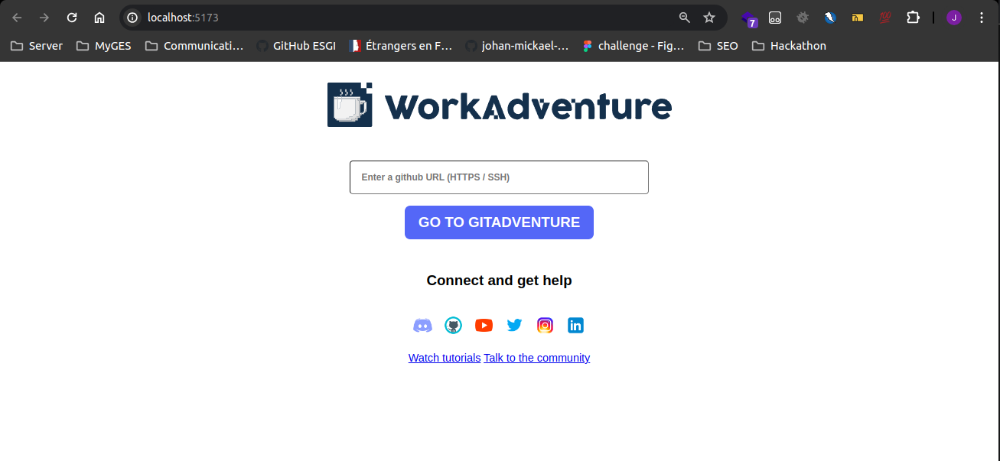
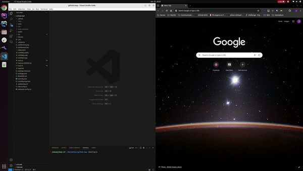

# GithubAdventure (Github x Workadventure)

### About the project

The purpose of this school project is to assemble all developers working on the same project on a dedicated [Workadventure](https://workadventu.re/) Map.

### Installation

1. Clone this repository.

```shell
git clone https://github.com/johan-mickael-myges/github-map.git
```

2. Run `npm install` to install all the necessary dependencies.

```shell
npm install
```

3. Run the project.

- First, run the API server.

```shell
npm run dev-api
```

> ⚠️ If it doesn't generates the `dist` folder on the first run, please run the command again.

> ℹ️ At the second run, it should generate the `dist` folder and you are now good to go to the next step.

- Then, open another terminal to run the main project.

```shell
npm run dev
```

It should open a new window in your default browser with the project loaded.

### Usage

1. On the default home page.

*After running the `npm run dev` command, you should see the default home page.*



You can now enter any GitHub repository URL in the input field:
> Example: https://github.com/workadventure/workadventure

And click on the `Go to Gitadventure` button.

2. In vscode.

- Download the extension from the [Visual Studio Code Marketplace](https://marketplace.visualstudio.com/items?itemName=JohanMickael.githubadventure).
- Open a Git repository in Visual Studio Code.
- Press `F1` to open the command palette.
- Type `GitHub Adventure` and select the command to start the adventure.

