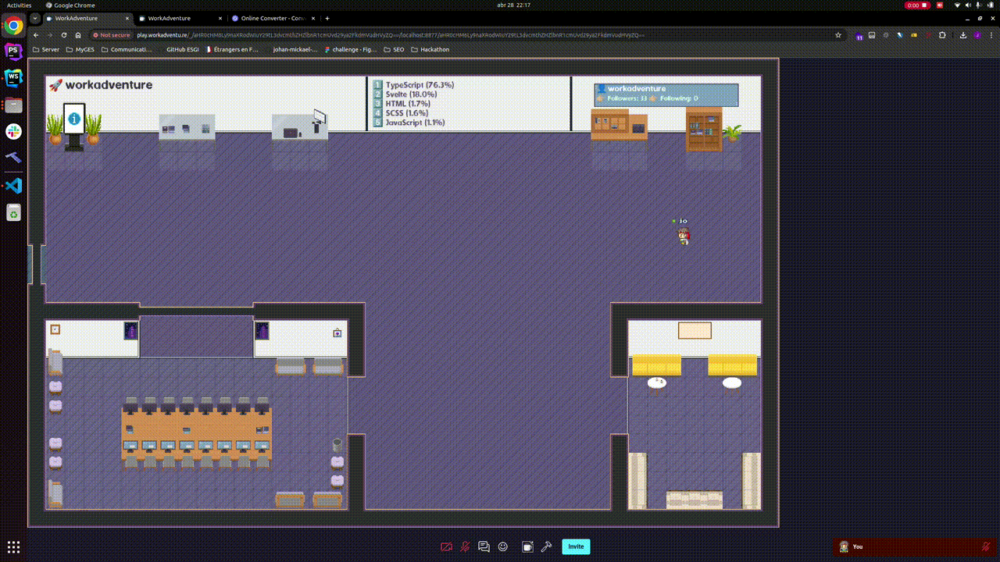

# GithubAdventure (Github x Workadventure)

## About the project

The purpose of this school project is to assemble all developers working on the same project on a dedicated [Workadventure](https://workadventu.re/) Map.

## Installation

1. Clone this repository.

```shell
git clone https://github.com/johan-mickael-myges/github-map.git
```

2. Run `npm install` to install all the necessary dependencies.

```shell
npm install
```

3. Run the project.

- First, run the API server.

```shell
npm run dev-api
```

> ⚠️ If it doesn't generates the `dist` folder on the first run, please run the command again.

> ℹ️ At the second run, it should generate the `dist` folder and you are now good to go to the next step.

- Then, open another terminal to run the main project.

```shell
npm run dev
```

It should open a new window in your default browser with the project loaded.

## Usage

### 1. On the default home page.

*After running the `npm run dev` command, you should see the default home page.*


You can now enter any GitHub repository URL in the input field:
> Example: https://github.com/workadventure/workadventure

And click on the `Go to Gitadventure` button.

### 2. In vscode.

- Download the [extension](https://github.com/johan-mickael-myges/github-adventure-vscode-ext) from the [Visual Studio Code Marketplace](https://marketplace.visualstudio.com/items?itemName=JohanMickael.githubadventure).
- Open a Git repository in Visual Studio Code.
- Press `F1` to open the command palette.
- Type `GitHub Adventure` and select the command to start the adventure.


---

# ESGI Section

## Associated project
See also the [Gitadventure VSCode Extension](https://github.com/johan-mickael-myges/github-adventure-vscode-ext) source code.

## Developers

- NGUYEN Huy Hoang [nghuyhoang0204](https://github.com/nghuyhoang0204)
- Ouahabi Ibrahim [Narutino10](https://github.com/Narutino10)
- RAKOTONIAINA Johan Mickaël [johan-mickael-myges](https://github.com/johan-mickael-myges)
- SAGOUTI Hicham [SagoutiHicham](https://github.com/SagoutiHicham)

## Tasks

- [NGUYEN Huy Hoang](https://github.com/nghuyhoang0204)
  - [x] Initializing the [vscode extension](https://github.com/johan-mickael-myges/github-adventure-vscode-ext) project structure.
  - [x] GithubAdventure extension [documentation](https://github.com/johan-mickael-myges/github-adventure-vscode-ext/blob/main/README.md).
  - [x] Updating the map skeleton.
- [Ouahabi Ibrahim](https://github.com/Narutino10)
  - [x] Updating the map skeleton.
  - [x] GitAdventure homepage design.
  - [x] Adding the GitAdventure homepage form.
- [RAKOTONIAINA Johan Mickaël](https://github.com/johan-mickael-myges)
  - [x] Generating workadventure map dynamically (Serverside map UI).
  - [x] Adding the Github API.
  - [x] Embed custom repository list page in the page.
  - [x] Handling vscode exception workflow.
  - [x] Deploying the vscode extension.
- [SAGOUTI Hicham](https://github.com/SagoutiHicham)
  - [x] Ability to link local git repository to workadventure map.

## Features

### 1. VSCode Extension 

- **Start Adventure**: This feature welcomes you to the GitHub Adventure and provides an option to start the adventure. If you choose to start, it will open the adventure map in your default browser.


- **Exception handling**
> If you're not in a Git repository, this feature offers to open the GitHub Adventure homepage for you to access a remote Git repository.


### 2. GithubAdventure Map

- **Homepage**: The homepage allows you to enter a GitHub repository URL and open a gitadventure map.
- **Map**: The map is generated dynamically based on the GitHub repository URL.

> Example: git@github.com:facebook/react.git
> (Yeah, it's also working on ssh URL)

Would generate the following map:


- **Scripting API**

    Each object on the map are generated dynamically based on the GitHub repository information.

    

    2. Readme file integrated in the map:
  
    

    3. Browse the repository on GitHub:
    
    

    4. Owner informations (Popup + New browser tab on github)

    

    5. Listing other repositories from the owner (Custom Github Page)

    

    6. Teleportation to other owner's repositories

    

    7. Go back to the homepage (Quit the current map)

    

> **ℹ️ Note**: All generated maps contains the default features of the Workadventure map (Jitsi Meeting, Jitsi Chill Zones, Quiet zones, etc ...)
> **See more** on the [Workadventure Documentation](https://docs.workadventu.re/map-building/)

  